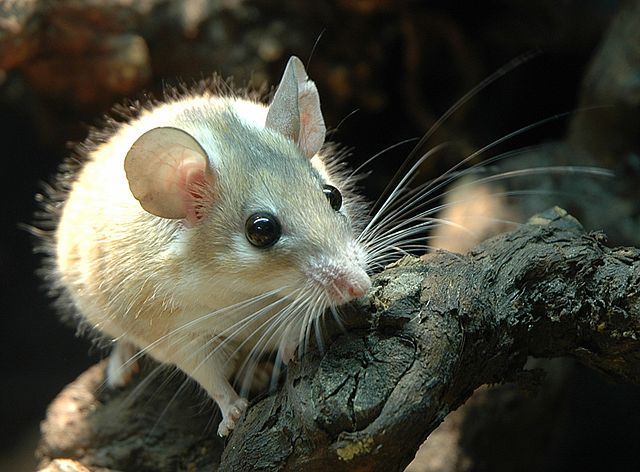

# Hello World

So far using the new github project pages is a confusing process. Apparently a site generator is missing (before there used to be a button), but now there's just more flexibility in where one can stash the page (either in / of master, or in docs/ of master, or in gh-pages).

Back when I built my page it was in gh-pages, although I do see the benefit of keeping it in master, and putting it in a folder ... 

Here's a reindeer from pixabay.com:

Below this text should be a mouse that was brough along for the ride:

